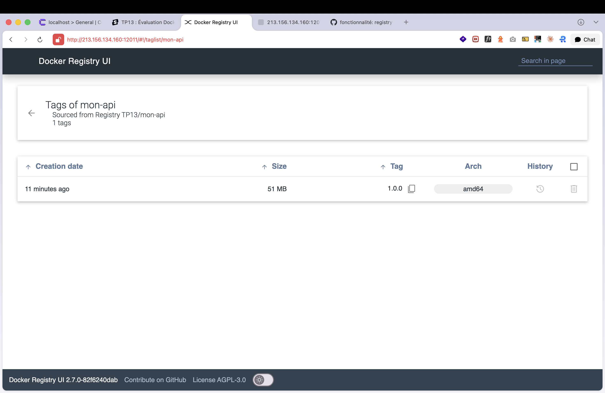
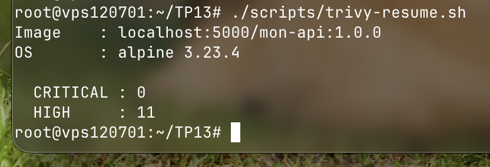
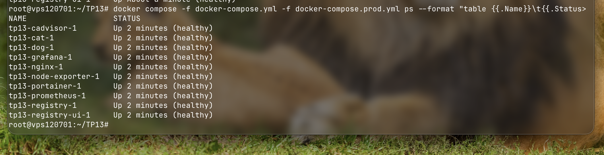
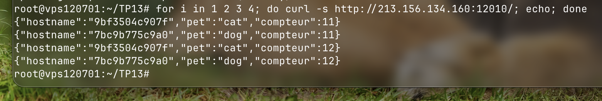
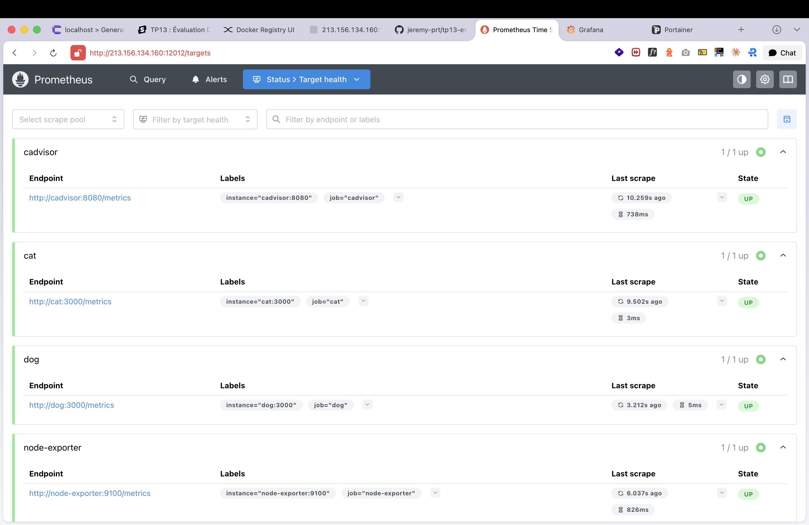
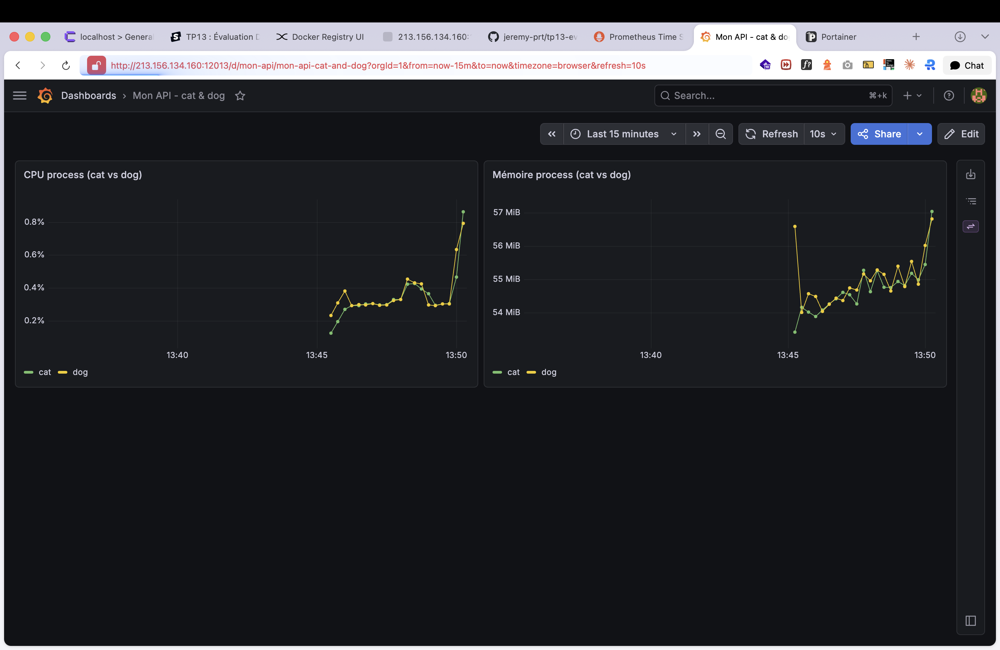
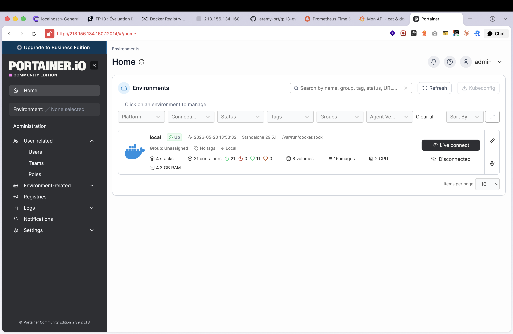
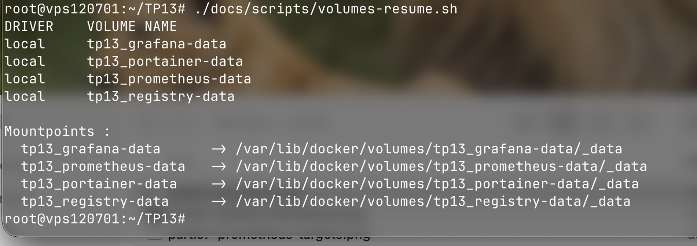
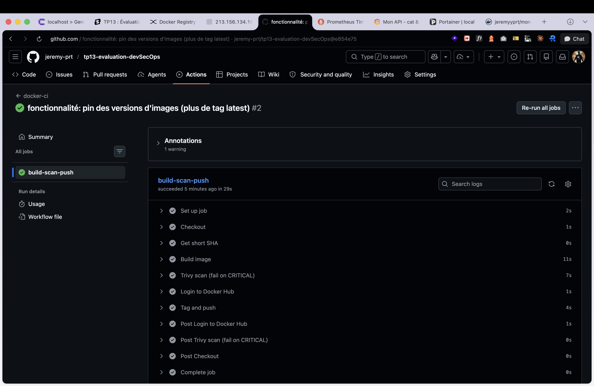
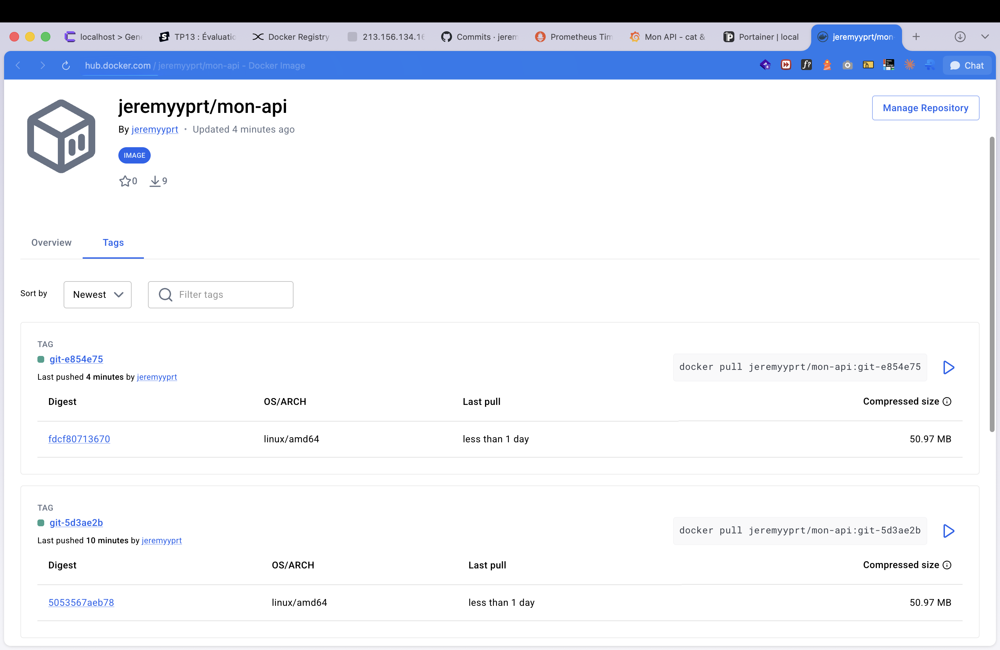

# TP13 - Évaluation Docker

API Node.js cat/dog derrière un Nginx en load-balancing, registry privé, monitoring Prom/Grafana, déploiement VPS et CI GitHub Actions.

## Sommaire

- [URLs publiques](#urls-publiques)
- [Identifiants](#identifiants)
- [Partie 1 - API & Dockerfile](#partie-1---api--dockerfile)
- [Partie 2 - Registry privé](#partie-2---registry-privé)
- [Partie 3 - Stack Compose & Nginx](#partie-3---stack-compose--nginx)
- [Partie 4 - Sécurité](#partie-4---sécurité)
- [Partie 5 - Validation](#partie-5---validation)
- [Partie 6 - Questions théoriques](#partie-6---questions-théoriques)
- [Partie 7 - Observabilité & Production](#partie-7---observabilité--production)
- [Partie 8 - Volumes](#partie-8---volumes)
- [Partie 9 - CI/CD GitHub Actions](#partie-9---cicd-github-actions)
- [Partie 10 - Déploiement VPS](#partie-10---déploiement-vps)
- [Infos complémentaires](#infos-complémentaires)

## URLs publiques

| Service | URL |
|---|---|
| API via Nginx | http://213.156.134.160:12010/ |
| API /cat | http://213.156.134.160:12010/cat |
| API /dog | http://213.156.134.160:12010/dog |
| Prometheus | http://213.156.134.160:12012 |
| Grafana | http://213.156.134.160:12013 |
| Portainer | http://213.156.134.160:12014 |
| Registry UI | http://213.156.134.160:12011 |

## Identifiants

| Service | User | Pass |
|---|---|---|
| Grafana | admin | admin |
| Portainer | admin | admin1234567 |

---

## Partie 1 - API & Dockerfile

J'ai mis mon API dans le dossier `api/`. C'est du Express tout simple avec prom-client pour exposer les métriques. Le Dockerfile part de node:20-alpine, je crée un utilisateur `app` et je tourne dessus pour pas être en root, et j'ai branché un healthcheck Docker sur la route `/healthz`.

## Partie 2 - Registry privé

Le registry tourne dans son propre fichier compose `docker-compose.registry.yml`. J'utilise l'image officielle registry:2, plus l'UI joxit/docker-registry-ui pour voir ce qu'il y a dedans depuis le navigateur. Une fois lancé j'ai tagué et push mon image dessus, dcp le compose principal pointe sur `localhost:5000/mon-api:1.0.0` et plus sur un build local.



## Partie 3 - Stack Compose & Nginx

Trois services sur un réseau Docker custom, deux instances de mon API (une avec PET=cat, l'autre avec PET=dog) et un Nginx en load-balancer devant. Sur `/`, Nginx fait du round-robin entre les deux via un upstream. J'ai aussi mis deux locations exclusives, `/cat` qui tape direct sur cat et `/dog` sur dog. Le depends_on est en condition service_healthy, dcp Nginx démarre seulement quand cat et dog sont vraiment prêts.

## Partie 4 - Sécurité

Tous les ports et le PET de chaque service sont dans le `.env`, comme ça je peux tout ajuster sans toucher au compose. Côté Dockerfile, j'ai mis `COPY package*.json` avant `COPY . .` pour que Docker garde en cache le npm install tant que mes dépendances bougent pas. Et le `.dockerignore` exclut node_modules, .env et .git, pour pas envoyer n'importe quoi dans le contexte de build.

Pour le choix de l'image, j'ai pris node:20-alpine. Le 20 c'est la LTS, et la variante alpine donne une image finale autour de 150 Mo contre 1 Go en Debian. Dcp moins de surface d'attaque et moins de CVEs à patcher.

Et voilà le scan Trivy sur l'image dans le registry, 0 CVE CRITICAL dcp la CI passe le step Trivy.



## Partie 5 - Validation

Tous les services montent bien en Up (healthy) :



Et voilà le round-robin Nginx en action sur 4 appels successifs au `/` :



On voit que les compteurs sont propres à chaque conteneur (un côté cat, un côté dog), et le hostname correspond à l'ID du conteneur qui a répondu.

## Partie 6 - Questions théoriques

### 1. Swarm

`docker compose up` en gros c'est en local sur ma machine, un seul docker, tout tourne au même endroit. Outil de dev.

`docker stack deploy` c'est ce que je dois utiliser quand je travaille sur un cluster Swarm avec plusieurs nœuds. Là c'est Swarm qui s'occupe de tout, il dispatch les conteneurs, redémarre ce qui crash, fait du LB entre les réplicas.

Pour le `build:` en Swarm ça marche pas, parce qu'avec plusieurs nœuds, faudrait que chaque nœud rebuild la même image dans son coin, et en plus le résultat pourrait être différent d'un nœud à l'autre. Dcp je build une fois, je push sur un registry, et tous les nœuds pull la même image. C'est pour ça que `build:` est ignoré, faut utiliser `image:`.

### 2. Secrets

Une var d'env c'est lisible direct dans le conteneur (`printenv`, `docker inspect`...). Dcp pour un password ou un token c'est en clair, ça craint.

Un Docker Secret c'est différent, Swarm le stocke chiffré et il arrive dans le conteneur comme un fichier monté en mémoire, sur `/run/secrets/<nom>`. Il apparaît pas dans `docker inspect`, plus safe.

En Node.js pour le lire c'est juste de la lecture de fichier classique :

```js
const fs = require('fs');
const password = fs.readFileSync('/run/secrets/db_password', 'utf8').trim();
```

### 3. Backup

En prod faut backup tout ce que je peux pas reconstruire depuis zéro. En gros les volumes de données, genre les bases (Postgres, MySQL...), les uploads des users, l'historique Grafana/Prom si je veux garder les métriques, et les certifs TLS faits main.

Le reste je peux m'en passer, en effet les images je les rebuild, le code est sur Git, les conteneurs sont recréés par compose. Tout ce qui est déjà versionné quelque part, pas besoin.

Si je dois retenir une règle simple c'est que, si je perds le serveur, est-ce que je retrouve la donnée ailleurs (Git, registry...) ? Oui = pas de backup. Non = backup obligatoire.

## Partie 7 - Observabilité & Production

Prometheus est configuré pour scraper cat, dog, node-exporter et cadvisor toutes les 10 secondes. La config est dans `monitoring/prometheus.yml`.



Grafana est auto-provisionné au démarrage. Le dossier `monitoring/grafana/provisioning` contient la datasource Prometheus qui se branche toute seule, et j'ai versionné un dashboard custom dans `monitoring/grafana/dashboards/mon-api.json` qui s'affiche sans que j'aie à toucher l'UI.



J'ai aussi ajouté Portainer pour avoir une UI de gestion Docker.



Et le fichier `docker-compose.prod.yml` est un override qui rajoute des limites CPU et mémoire (`deploy.resources.limits`) sur chaque service, pour pas qu'un conteneur seul bouffe toute la machine.

## Partie 8 - Volumes



J'ai mis des volumes nommés pour ce qui doit persister à travers les `docker compose down`, en gros la donnée générée à l'exécution. Concrètement il y en a quatre, `grafana-data` pour la conf Grafana (datasources, users, dashboards créés à la main), `prometheus-data` pour la base TSDB sinon je perds tout l'historique de métriques au redémarrage, `portainer-data` pour la conf Portainer, et `registry-data` pour les images push dans le registry sinon faut tout re-push à chaque restart.

Pour les configs qui vivent déjà dans le repo Git, j'utilise des bind mounts. Ça concerne `nginx/default.conf` pour le LB, `monitoring/prometheus.yml` pour les targets, et les dossiers `monitoring/grafana/provisioning` et `monitoring/grafana/dashboards` pour le provisioning auto. Tous montés en `:ro` parce que c'est de la conf, j'y touche pas depuis le conteneur.

La règle que j'applique, si la donnée est dans le repo c'est un bind mount, si elle est générée à l'exécution et doit persister c'est un volume nommé.

## Partie 9 - CI/CD GitHub Actions

Le workflow `.github/workflows/docker.yml` se déclenche sur chaque push sur main. Concrètement il fait quatre choses, build de l'image, scan Trivy qui fail si une CVE CRITICAL est trouvée, login sur Docker Hub, et push avec un tag SHA court (par exemple `git-abc1234`).

Les secrets `DOCKERHUB_USERNAME` et `DOCKERHUB_TOKEN` sont configurés au niveau du repo GitHub.



L'image est dispo sur Docker Hub avec son tag SHA :



## Partie 10 - Déploiement VPS

La stack complète est déployée sur le VPS de l'école, accessible publiquement aux URLs listées tout en haut.

IP du VPS : **213.156.134.160**

Toute la stack tourne en Up (healthy) (voir capture Partie 5).

---

## Infos complémentaires

### Stack et ports

| Service | Image | Port interne | Port hôte VPS |
|---|---|---|---|
| API cat | localhost:5000/mon-api:1.0.0 | 3000 | interne |
| API dog | localhost:5000/mon-api:1.0.0 | 3000 | interne |
| Nginx (LB) | nginx:1.27-alpine | 80 | 12010 |
| Prometheus | prom/prometheus:v3.11.3 | 9090 | 12012 |
| Grafana | grafana/grafana:13.0.1 | 3000 | 12013 |
| Node Exporter | prom/node-exporter:v1.11.1 | 9100 | interne |
| cAdvisor | gcr.io/cadvisor/cadvisor:v0.55.1 | 8080 | interne |
| Portainer | portainer/portainer-ce:2.41.1-alpine | 9000 | 12014 |
| Registry | registry:2 | 5000 | 5000 |
| Registry UI | joxit/docker-registry-ui:2.6.0 | 80 | 12011 |

Le VPS de l'école est partagé avec Coolify qui occupe déjà 80, 443, 8080 et 8083. Dcp j'ai dû remapper les ports standards du TP sur la plage 12000-12100 qui est dispo.

### Lancement local

```bash
# Cloner
git clone https://github.com/jeremy-prt/tp13-evaluation-devSecOps.git
cd tp13-evaluation-devSecOps

# Registry
docker compose -f docker-compose.registry.yml up -d

# Build + push image
docker build -t mon-api:1.0.0 ./api
docker tag mon-api:1.0.0 localhost:5000/mon-api:1.0.0
docker push localhost:5000/mon-api:1.0.0

# Stack complète + prod limits
docker compose -f docker-compose.yml -f docker-compose.prod.yml up -d
```
